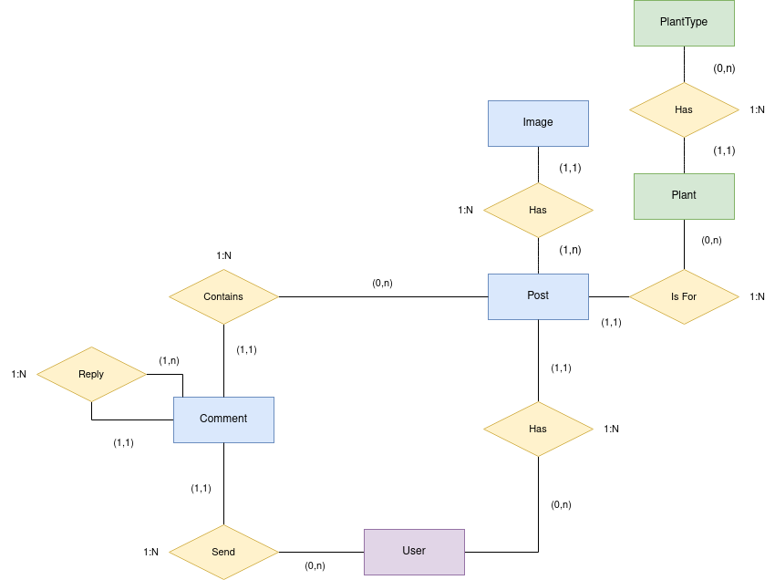
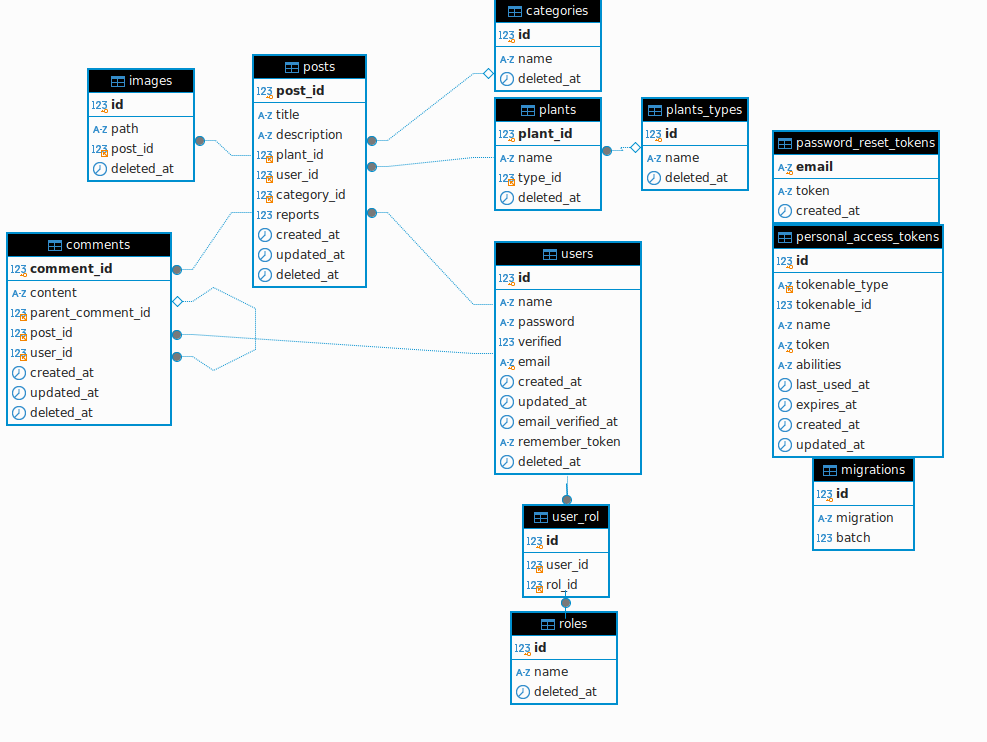

# CuidadoPlantas
- [CuidadoPlantas](#cuidadoplantas)
  - [Entity Relationship Diagram](#entity-relationship-diagram)
  - [Database Structure](#database-structure)
  - [Test Coverage](#test-coverage)

## Entity Relationship Diagram

## Database Structure

## Test Coverage
[View Test Coverage](Plantas/coverage/index.html)